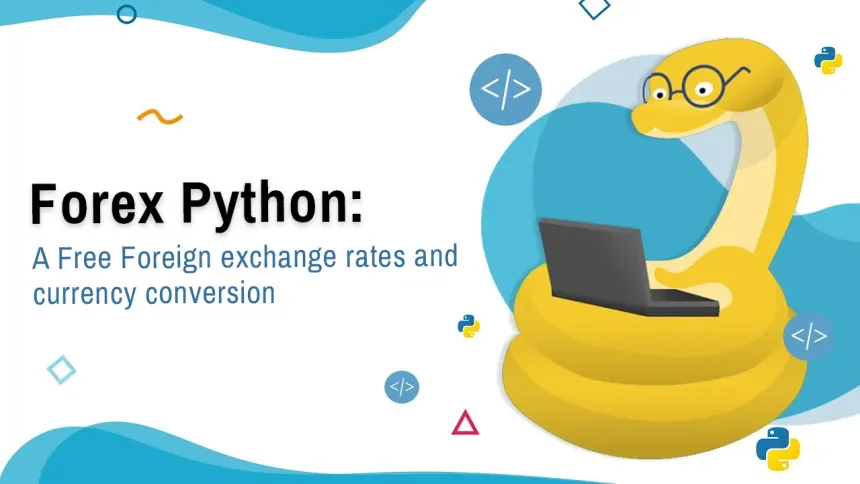

# Currency Converter App

## Description

The Currency Converter App is a web application built using Flask that allows users to convert
between different currencies.
It the forex-python library to fetch the latest exchange rates and provides a simple, intuitive
and user-friendly interface for performing conversions.

## Requirements

Python 3.6+
Flask
Requests

## Installation

### Clone the repository:

git clone https://github.com/yourusername/currency-converter.git

### Change working directory to the root of the app:

cd currency-converter

### Create and activate a virtual environment:

python -m venv venv
source venv/bin/activate  # On Windows use `venv\Scripts\activate`

### Install the dependencies:

pip install -r requirements.txt

#### Set up environment variables:

Create a .env file in the root directory of the project and add your API key for the currency exchange rates:
API_KEY=your_api_key

## Usage
Run the Flask application:
flask run
Open your web browser and navigate to http://127.0.0.1:5000 to access the application.
Follow these steps to convert one currency to another:
- Provide an amount of base currency to convert to target currency.
- Select base currency.
- Select target currency.
- Click the convert button to convert the amount of base currency to target currency.

## License

This project is licensed under the MIT License. See the LICENSE file for details.
